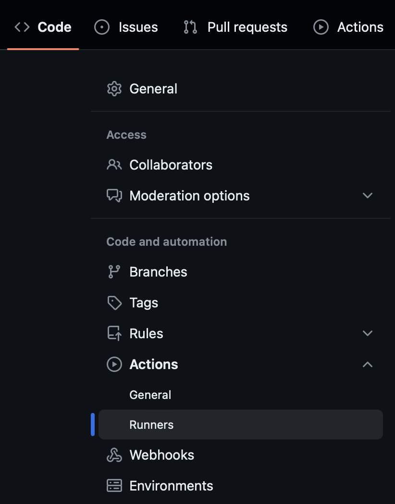

# riscv64-github-runner
Docker recipe for a riscv64 GitHub local runner

GitHub has popularized using CI/CD within the platform with ease, and they provide VMs from different Linux distributions as well as Windows and MacOS, and even provide different architectures like x86-64 and arm64, so that software can be compiled and tested natively (without using cross compilers). This is of course quite beneficial for free software projects that want to both test, and release binary versions of their software.

Yet, GitHub does not provide at the time with RISC-V 64 bit architecture VMs. What this project tries to do, is to share documentation, docker containers and recipes on how to use and run CI/CD pipelines with GitHub under several distributions.

If you are a RISC-V Lab and want to use this methods, please got a bit below in this document to find instructions on how to run a runner.

If you are a software project that requires a GitHub local runner with a RISCV64 architecture, please follow this steps.

## Instructions for setting up a RISCV64 CI/CD pipeline with GitHub

1. Contact a RISC V Lab. You can use the [Costa Rica RISCV Lab](https://github.com/fede2cr/CR-RISCV-Lab) (unofficial lab) or the first official lab which is [10x Enginners](https://riscv.org/risc-v-lab-partner/). Let them know what your project will be working on, how frequent will you run workloads, and how big are those workloads.

2. Setup a GitHub CI/CD action like you can find in the [example](doc/CI-example.md) or follow the more complex example of projects that build [Python wheel packages](https://github.com/fede2cr/riscv64-python-whl) on RISCV64 or that build [KDE9](https://github.com/fede2cr/riscv64-kde9-compiler) on RISCV64.

3. Create a key for your runner in GitHub. You may request multiple runner keys to your RISCV Lab by running this step multiple times. This should allow you to run on multiple hardware if your project is big enough to require it.

In GitHub, go to your project, and on the top menu, click on Settings.


Inside the Settings menu, look for Actions and inside of it for Runners.



Now click on the New self-hosted runner, green button.


Here, look for the runner token. This is a capitalized alpha-numeric code that you can see in this screenshot. Copy this text and send it to your RISCV Lab, as they will need this information to complete the configuration process on their side.

**Please** note that you do not have to run this commands anywhere. This is what GitHub recommends to run their runner software, but since they don't support RISCV64 yet, it is being done with another piece of free software.


After you share this code with your favorite RISCV Lab, they will need to run a couple of commands on their side, and will let you know when you can start using your runner.

4. Send some code to GitHub to activate the runner and start testing your runner. Please be nice to your Lab and let them know if you do not need your runner so that they can clean up on their side, and leave the resources available for other projects.

## Instructions for setting up runners, for a RISCV Lab

If you are a RISCV Lab or you have some riscv64 hardware that is able to run docker or podman, you can follow these simple steps to have a runner working. You will have to repeat them for earch runner that you plan to configure which will be at least one for each new project and each project could have more than one runner so that they can run on different hardware by splitting CI tasks. So keeps this doc bookmarked, or use automation to run the steps.

Please test docker/podman before running these steps. Look at the FAQ for more info.

Run this on an empty directory:

```
wget -q 'https://github.com/ChristopherHX/github-act-runner/releases/download/v0.6.8/binary-linux-riscv64.tar.gz'
tar xf binary-linux-riscv64.tar.gz

```

The results will look like the following screenshot:


Configure the runner. Use here the runner token that you got from the project that wishes to do runners in your lab:

```
./config.sh
```
The result will look like this:


Now cleanup the binary tarfile:
```
rm binary-linux-riscv64.tar.gz
```

Start the runner manually for testing. This example uses podman on a terminal, but of course you can use [systemd](https://docs.docker.com/config/daemon/systemd/), Kubernetes or any method which is useful for your Lab.

Here we use the Ubuntu container as an example. Ask the project which distro/container they preffer to run on.

```
podman run --userns keep-id -v $(pwd)/:/usr/local/runner fede2/github-runner-ubuntu:v0.1
```

If all went well, this is how the output should look like:


On the side of the project, on GitHub, if they click on Settings, Actions, Runners again, it will look like this:


## Distribution images

This is the current list of distributions supported. Please take a look at the FAQ below if you require other distributions or packages to be added.

|Distribution|Version|Docker Hub Link|Image short name|Source|Status|
|------------|-------|---------------|----------------|------|------|
|Ubuntu|22.04|[github-runner-ubuntu](https://hub.docker.com/r/fede2/github-runner-ubuntu)|fede2/github-runner-ubuntu|[ubuntu-runner/](ubuntu-runner/)|Ready for use|
|Fedora|39|[fedora-rv64](https://hub.docker/com/r/imbearchild/fedora-rv64)|imbearchild/fedora-rv64|[fedora-runner/](fedora-runner)|Testing|
|Mariner|2|[github-runner-azurelinux](https://hub.docker.com/r/fede2/github-runner-azurelinux)|fede2/github-runner-azurelinux|[github-runner-azurelinux/](github-runner-azurelinux/)|Testing|

## FAQ

- I want to use a distribution but is not on this list, can you please provide docker images for that particular distribution?

Yes, please create an issue stating what distribution and what version do you need and we will work on it.

- Is the software in this VMs, exactly what I would find on a GitHub VM?

No it is not, but it can be. If you are missing any obvious software from the images you would need to install it via apt-get/dnf for not, but also create an issue and let us know which software is it, to review if it makes sense to add it to the base images.

- Does the VMs get clean every time there is a new action sent to the runner?

This is very easy as they are docker images, but it is not happening as the current runner software does not exit after a failure or completion. This is a priority for this project and we hope to work on it very soon.

- Docker, podman, firecracker?

This currently works on both docker and podman. We hope to test firecracker images very soon.

- Does any riscv64 hardware work for running docker/podman GitHub runners?

We recommend at least a 4-core+8G-ram hardware, for example boards like LicheePi4a, Mars, Starfive II, etc. If you have a 64-core MilkV Pioneer things will be easier as they can have up to 128G ram and this will allow large projects and languages that require lots of memory while compiling. You can also limit the count of cores or the ram available to the runners by changing docker/podman parameters.

- Does any riscv64 distribution work for running docker/podman runners?

Not at all. Most riscv64 "early" distributions provided by hardware vendors, are missing one or two simple modules that make it hard or impossible to run docker/podman containers on this type of hardware. A simple kernel recompile will do, but please contact your hardware vendor so that they can add the missing options to the next release of the distribution. The Fedora 38 that comes with the MilkV Pioneer works out of the box.

- Are the base docker images built by each distribution?

No, RISCV64 is not supported officially as a main architecture by almost no distribution, so it will take time for them to release resources such as installer images and docker images. Talk to your distribution to make them know this will be useful to your project.

- Aren't docker short names dangerous?

Yes they are. They are only being used as short in this documentation. The Dockerfile for each image is using the "long" name which is recommended.
